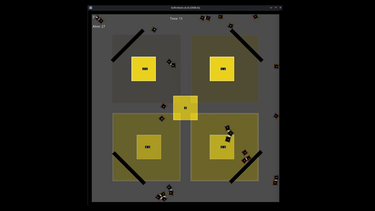

# SoftbodyGodot

An Artificial Life simulation of softbody organisms that can **self-replicate, form physical attachments, and evolve attachment/movement behavior** over time. Built in Godot 4 using the [Rapier2D](https://github.com/appsinacup/godot-rapier-2d) physics engine and the [SoftBody2D](https://github.com/appsinacup/godot-softbody2d) addon.

---

## Overview

Each organism ("bot") is a softbody composed of 9 rigid bones connected by joints. Bots navigate a 2D environment, seek food sources to maintain energy, and replicate when conditions are met — passing a mutated copy of their gene to offspring.

The emergent behavior of interest is **attachment**: bots can physically join with neighboring bots upon collision, forming multi-cell structures that share energy. Whether a bot seeks or avoids attachment — and when it breaks free — is encoded in its gene.

The simulation was developed as part of PhD research on **Quality-Diversity (QD) algorithms** applied to Artificial Life and morphological evolution.

---

## How it works

### Gene structure

Each bot carries a gene encoding 5 behavioral parameters:

| Gene component | Type | Description |
|---|---|---|
| `MovementProbs` | Dictionary | Weighted probability of moving N/S/E/W or staying still |
| `AttachProbability` | Dictionary | Probability of joining on collision, indexed by current number of links |
| `DettachProbability` | Dictionary | Probability of breaking a joint per step, indexed by number of links |
| `DeathLimit` | int | Maximum number of simultaneous links before forced death |
| `LimitToReplicate` | int | Minimum number of links required to replicate |

These two last genes create a tension: a bot may need to be attached to replicate, but being attached too much kills it.

### Energy economy

- Bots consume energy every step (**metabolism**) and when moving (**movement cost = force × multiplier**)
- Energy is replenished by entering **food source areas**
- Bots that share a physical attachment form an **energy bank** — they pool and share resources collectively
- A bot that runs out of energy dies

### Death conditions

A bot can die for four reasons:
1. **Starvation** — energy reaches zero
2. **Structural failure** — center bone is struck in a collision
3. **Link overload** — number of active attachments reaches `DeathLimit`
4. **Age** — probability of death increases steeply past a configurable `CriticalAge` (logistic curve)

### Replication

When a bot accumulates sufficient energy (configurable threshold) and has been alive long enough since its last replication (cooldown), it spawns a child nearby. The child inherits the parent's gene with possible point mutations. The parent loses a configurable fraction of its energy.

---

## Running the simulation

**Requirements:** Godot 4.4 with the [godot-rapier-2d](https://github.com/appsinacup/godot-rapier-2d) and [godot-softbody2d](https://github.com/appsinacup/godot-softbody2d) addons installed.

1. Clone the repository
2. Open the project in Godot 4.4
3. Run `Scenes/main.tscn`

To spawn bots manually during the simulation:
- **Left click** — spawn a bot at mouse position
- **ESC** — end simulation and save log

---

## Configuration

All simulation parameters are loaded from `Parameters.json` at startup. 

---

## Logging

The simulation logs all events to a structured text log via `LogManager`:

- Bot births and deaths (with cause)
- Replication events (parent → child lineage)
- Joint creation and break events
- Per-bot snapshots at death

Logs are saved to the path configured in `Parameters.json` → `General.LogAddress`.

---

## Known limitations

**Physics non-determinism:** The Rapier2D engine does not guarantee identical simulation outcomes even when a fixed seed is set. Collision resolution and joint dynamics produce different results across runs under identical initial conditions. This makes controlled replication experiments infeasible with the current physics backend and was the primary reason this project was paused in favor of alternative approaches.

This is a known limitation of real-time physics engines in research contexts. Possible future directions include: using a deterministic physics layer, abstracting physics into a discrete model, or treating each run as a distinct sample in a stochastic analysis.

---

*Godot 4 · GDScript · Rapier2D · SoftBody2D · Python-based log analysis*
